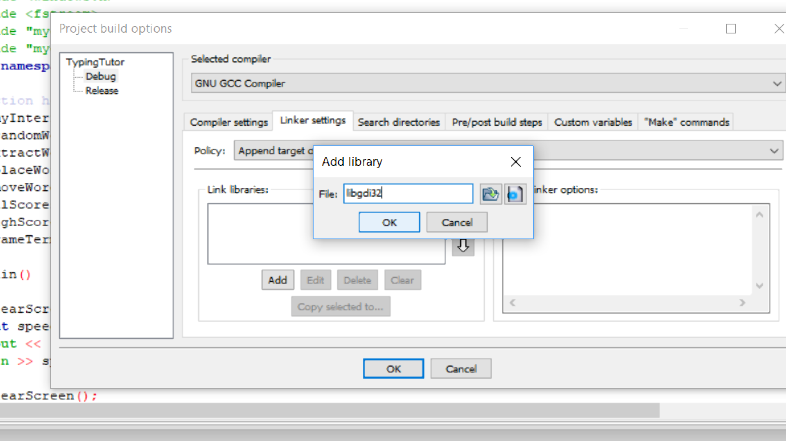

# Typing-Tutor
> A C++ typing game to increase familiarity with the keyboard in a fun way . Learn the keyboard keys while also sharpening your memory by typing words that appear for a split second!!

> Also, this was my first ever programming game that I made in my first semester of undergrad program. So feel free to make improvements and generating pull requests.

## Interface

## How to Run
* In the folder TypingTutorCode, run the exe file "TypingTutor.exe"to directly execute it.

*OR*
* Open "TypingTutor.cbp" in CodeBlocks, then build and run it.
** Make sure the library "libgdi32" is added in codeblocks. To add it go to Project -> Build Options -> Linker Settings -> add -> libgdi32

### To recompile using Command Prompt
The game was originally compiled using GCC compiler
* Give path to the bin folder of GCC compiler
* Then navigate to the directory containg code files
* Type the command `g++ -o main.exe myconsole.cpp main.cpp mygraphics.cpp -lgdi32`
* Then finally execute it by `main.exe`

## How to Play???
**Open console in full screen**

### Rules
*For Upward Motion*
1. Word will appear for a split second and then vanish.
2. User has to enter the exact three character if he wants the word to move in the row above
3. If the user enters the word incorrectly, the word will appear again. This time the word will be one step above.
4. The word will then vanish again.
5. The user should only enter the word correctly when that word is **exactly one row below** its matching word.
6. The user will win if five words are placed correctly. Otherwise the game will terminate after seven tries

*For Downward Motion*: 
The user should enter the word correctly when that word is **exactly one row above** its matching word.

* High scores are also maintained and saved through filing.
* High scores can be set to zero again by making the changes in the *highScore.txt* file.

## Contributions
Your proposed improvements to the repository are most welcome.
* Feel free to fork the repository using the following link <https://github.com/Zaraahmad/Typing-Tutor/fork>
* Commit your changes to the forked repository
* Submit pull request to the [Typing Tutor Repository](https://github.com/Zaraahmad/Typing-Tutor)

Also if you found it useful, please give it a star :D

Have fun playing!

## License
[MIT](../master/LICENSE)

## Author
[**Zara Ahmad**](https://github.com/Zaraahmad)

To stay updated with my GitHub Repositories follow me here on github:

